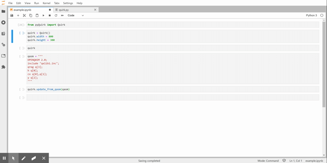

# pyQuirk
[](https://pypi.org/project/pyQuirk/)

A Python [widget](https://github.com/jupyter-widgets/ipywidgets) for [Quirk](https://github.com/Strilanc/Quirk) to be used in Jupyter notebooks, JupyterLab, and the IPython kernel.



## Getting Started
### Installation

To install use pip (JupyterLab 3 recommended):

    $ pip install pyQuirk

If you are wanting to use this with JupyterLab 2 or a classical Jupyter notebook install (i.e. not the one included with JupyterLab 3), then you can try following the [development install instructions](#development) below, but YMMV.

### Example

Take a look at [example.ipynb](example.ipynb) for a simple example.

Otherwise, you can simply run:
```python
from pyQuirk import Quirk
quirk = Quirk()
quirk
```

### API

Quirk()
- `width`: display width of the widget
- `height`: display height of the widget
- `scale`: scale of the inner Quirk display (default 0.5)
- `value`: circuit in Quirk format
- `circuit_qasm`: read-only property to get the qasm of the current circuit
- `update_circuit(circuit)`: convenience function for passing a Qiskit circuit
- `update_from_qasm(qasm)`: replace the current circuit with qasm (not all gates supported, currently)

## Development

For a development installation (requires [Node.js](https://nodejs.org) and [Yarn version 1](https://classic.yarnpkg.com/)),

    $ git clone https://github.com/adgt/pyQuirk.git
    $ cd pyQuirk
    $ pip install -e .

If you are working with Jupyter notebook, then run these commands:

    $ jupyter nbextension install --py --symlink --overwrite --sys-prefix pyQuirk
    $ jupyter nbextension enable --py --sys-prefix pyQuirk

If you are working with JupyterLab 3, run the command:

    $ jupyter labextension develop --overwrite pyQuirk

Then you need to rebuild the JS when you make a code change:

    $ cd js
    $ yarn run build

You then need to refresh the JupyterLab page when your javascript changes.

#### Project repository created with the [widget-cookiecutter](https://github.com/jupyter-widgets/widget-cookiecutter) template